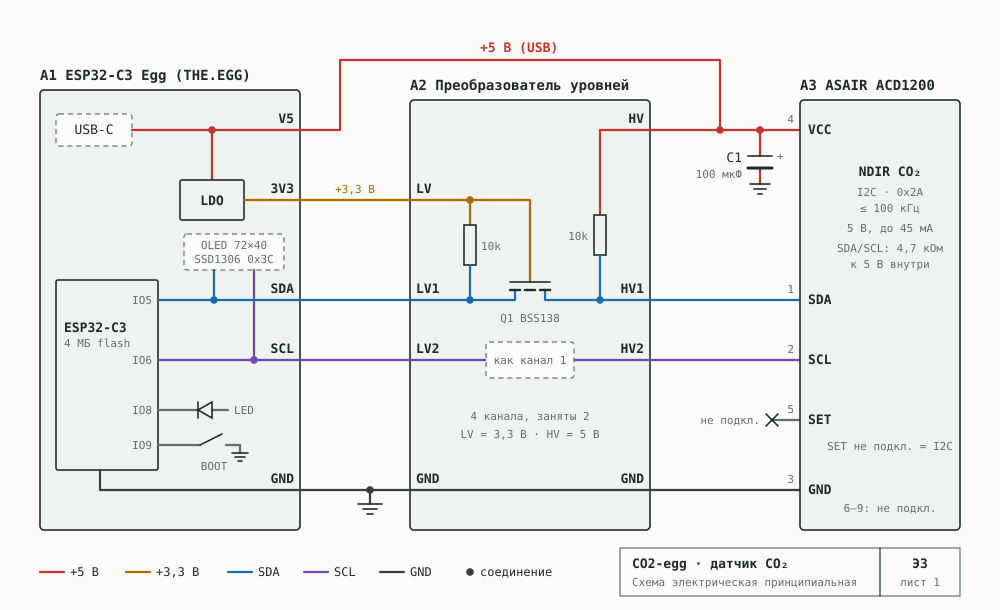

# 06. Проект 1: датчик CO2 — ESP32-C3 «EGG» + ASAIR ACD1200

## Железо

### Плата ESP32-C3 «Egg» (THE.EGG)

По фото владельца: синяя плата формата «SuperMini» с USB-C и экраном 0.42" OLED, демо-прошивка
выводит «ESP32-C3 / EGG / THE.EGG». Это **не** 01Space-версия (у той есть RGB WS2812B и разъём Qwiic,
здесь их нет), а распространённая плата «ESP32-C3 0.42 OLED» в формате SuperMini
(см. [atomic14](https://www.atomic14.com/2026/02/16/esp32-c3-oled), [espboards](https://www.espboards.dev/esp32/esp32-c3-oled-042/)).

| Параметр | Значение |
|---|---|
| SoC | ESP32-C3 (скорее всего FH4: RISC-V 160 МГц, 400 КБ RAM, **4 МБ flash**) — проверить `esptool flash_id` |
| Экран | 0.42", **72×40**, SSD1306-совместимый, I2C **0x3C**, **SDA = GPIO5, SCL = GPIO6** (типично для этих плат; проверить сканером I2C) |
| Светодиоды | красный PWR; **пользовательский светодиод на GPIO8** (подпись `IO8` на плате, обычно горит при низком уровне) |
| Кнопки | BOO (BOOT, GPIO9) и RST |
| USB | USB-C, встроенный в C3 USB-Serial/JTAG (консоль и прошивка без отдельного чипа) |
| Антенна | керамическая, встроенная |

**Выводы на гребёнках** (по фото):

| Левый ряд | Правый ряд |
|---|---|
| `V5` — 5 В от USB | `10` — GPIO10 |
| `GD` — GND | `9` — GPIO9 (кнопка BOOT, strapping) |
| `V3` — 3.3 В | `8` — GPIO8 (светодиод, strapping) |
| `RX` — GPIO20 | `7` — GPIO7 |
| `TX` — GPIO21 | `6` — GPIO6 (SCL экрана) |
| `2` — GPIO2 (strapping) | `5` — GPIO5 (SDA экрана) |
| `1` — GPIO1 | `4` — GPIO4 |
| `0` — GPIO0 | `3` — GPIO3 |

Проверка платы до начала разработки (одна команда + тестовая прошивка из репозитория):

```
esptool.py --chip esp32c3 flash_id          # объём flash
# firmware/devices/board-probe: сканер I2C на GPIO5/6 и 8/9, мигание GPIO8, опрос кнопки GPIO9
```

Выводы для проекта:
- 4 МБ flash — таблица разделов из [05](05-firmware-core.md) подходит как есть.
- У ESP32-C3 **один** аппаратный I2C-контроллер: экран и датчик будут на одной шине
  (адреса 0x3C и 0x2A не конфликтуют).
- GPIO9 (BOOT) — strapping-пин: как кнопку в приложении использовать можно, для «сброса из загрузчика» — нет.
- Датчику нужно **5 В** — пин `V5` (питание от USB-C).
- I2C датчика подключается к тем же `5`/`6`, что и экран (через преобразователь уровней).
- Свободные пины для будущих нужд: 0, 1, 3, 4, 7, 10, 20, 21. Пины 2, 8, 9 — strapping, при старте их не тянуть к земле.
- Для варианта с UART датчик вешается на `RX`/`TX` (GPIO20/21) — консоль всё равно идёт через USB.

### Датчик ASAIR (Aosong) ACD1200

NDIR-датчик CO2. Даташит: [ACD1200 (LCSC, C45354800)](https://datasheet.lcsc.com/lcsc/2504101957_Aosong-ACD1200_C45354800.pdf).
Протокол совпадает с семейством ACD (ACD10 / ACD3100), для которого есть открытые драйверы
[RobTillaart/ACD10](https://github.com/RobTillaart/ACD10) и [ACD3100](https://github.com/RobTillaart/ACD3100).

| Параметр | Значение |
|---|---|
| Диапазон | 400–5000 ppm, ±(50 ppm + 5% показания) |
| Питание | **4.75–5.25 В**, средний ток < 45 мА → только питание от USB, не от батареи |
| Интерфейсы | I2C (по умолчанию, пин 5 не подключён) или UART (пин 5 на землю) |
| I2C | адрес 0x2A (фиксированный), **максимум 100 кГц** |
| UART | 1200 бод, 8N1 |
| Уровни | вход 3–5 В; **выходы подтянуты внутри к 5 В (4.7 кОм)** |
| Прогрев | 120 с после включения |
| Период измерения | не чаще 1 раза в 2 с; ответ через ~80 мс после запроса |

### I2C или UART — что выбрать

**Рекомендация: I2C + двунаправленный преобразователь уровней (модуль на BSS138 или PCA9306).**

| | I2C + преобразователь | UART + делитель |
|---|---|---|
| Проблема 5 В | внутренние подтяжки датчика к 5 В → без преобразователя 5 В попадёт на GPIO5/6 и на экран. Преобразователь решает полностью | TX датчика даёт 5 В → делитель 10k/20k на линии в ESP; TX ESP (3.3 В) датчик понимает |
| Доп. детали | модуль-преобразователь (копейки, 4 провода) | 2 резистора |
| Протокол | известен и проверен (открытые драйверы, CRC-8 на каждые 2 байта), все команды: калибровка, ABC, сброс, версия | в открытых источниках описан хуже, надо сверять с даташитом |
| Пины | те же GPIO5/6, что у экрана, свободные пины не тратятся | 2 отдельных GPIO + UART1 |
| Скорость шины | всю шину придётся держать на 100 кГц (ограничение датчика); кадр экрана 72×40 = 360 байт ≈ 40 мс — незаметно | экран остаётся на 400 кГц |
| Замена датчика | большинство альтернатив (SCD40/41, Senseair Sunrise) — тоже I2C, драйвер-обёртка та же | |

Если не хочется ставить преобразователь — рабочий вариант UART + делитель, драйвер тоже предусмотрен
(`acd1200_uart`, пока не реализован — нужен даташит с командами UART). **Нельзя**: подключать датчик к I2C-шине платы напрямую —
подтяжка к 5 В через 4.7 кОм выведет из строя GPIO и, возможно, экран.

Схема подключения (I2C). Принципиальная схема: [img/co2-egg-schematic.svg](img/co2-egg-schematic.svg)



Кратко:

```
Плата Egg                 Преобразователь           ACD1200
 3V3  ───────────────────  LV                HV  ──── 5V ─── VCC
 5V (VBUS) ──────────────────────────────────HV
 GND  ───────────────────  GND              GND ───────────── GND
 GPIO5 (SDA, + OLED) ────  LV1              HV1 ───────────── SDA
 GPIO6 (SCL, + OLED) ────  LV2              HV2 ───────────── SCL
                                                     пин 5 (выбор интерфейса) — не подключать
```

#### Команды I2C

| Команда | Байты запроса | Ответ |
|---|---|---|
| Прочитать CO2 и температуру | `03 00`, ждать 80 мс, прочитать 9 байт | `[ppm_hi_hi ppm_hi_lo crc] [ppm_lo_hi ppm_lo_lo crc] [temp_hi temp_lo crc]` — CO2 32 бита, температура 16 бит |
| Режим калибровки (записать) | `53 06 00 <mode> crc` | 0 — ручная, 1 — автоматическая (ABC) |
| Режим калибровки (прочитать) | `53 06`, прочитать 3 байта | |
| Ручная калибровка (записать) | `52 04 <ppm_hi> <ppm_lo> crc` | целевое значение 400–5000 ppm |
| Прочитать цель ручной калибровки | `52 04`, прочитать 3 байта | |
| Сброс к заводским | `52 02 00` | |
| Версия прошивки датчика | `D1 00`, прочитать 10 байт | ASCII |
| Код/серийный номер датчика | `D2 01`, прочитать 10 байт | ASCII |

CRC-8: полином `0x31`, начальное значение `0xFF`, без отражения (как у Sensirion), считается на каждые 2 байта.

### Абстракция датчика («датчик может измениться»)

```c
typedef struct {
  const char *name;
  esp_err_t (*init)(const board_t *);
  esp_err_t (*read)(co2_reading_t *out);          // ppm, internal temp, status
  esp_err_t (*set_auto_calibration)(bool on);
  esp_err_t (*calibrate)(uint16_t target_ppm);
  esp_err_t (*factory_reset)(void);
  esp_err_t (*info)(char *fw, char *serial);
  uint32_t  min_interval_ms, preheat_ms;
} co2_sensor_ops_t;
```

Реализации: `acd1200` (I2C) — сейчас; `acd1200_uart` — позже, при необходимости; готовим место под `scd4x` (Sensirion SCD40/41, I2C 0x62,
+ влажность/температура), `senseair_s8` и `mhz19` (UART). Выбор — Kconfig и/или
автоопределение пробой I2C-адресов при старте. Тип датчика публикуется в `HELLO`/точке `sensor_model`,
а набор точек зависит от возможностей датчика (например влажность появится только у SCD4x) —
UI перестроится сам благодаря `DESCRIBE`.

## Точки устройства

| id | key | kind | тип | Описание |
|---|---|---|---|---|
| 1 | `co2` | sensor | f32 ppm | медиана последних 3 измерений; `history`, пороги 800/1200 |
| 2 | `sensor_temp_raw` | sensor | i32 | внутренняя температура датчика, сырое значение (`advanced`; шкала — по даташиту) |
| 3 | `status` | sensor | enum | `preheat`, `ok`, `sensor_error` |
| 4 | `sensor_model` | sensor | str | `ACD1200 fw …` (`advanced`) |
| 10 | `report_interval` | setting | i32 с | 5–600, по умолчанию 30 |
| 11 | `report_delta` | setting | i32 ppm | отправить сразу при изменении ≥ N (по умолчанию 25) |
| 12 | `auto_calibration` | setting | bool | ABC-режим датчика (по умолчанию вкл) |
| 13 | `display_mode` | setting | enum | `co2`, `co2_graph`, `night`, `off` |
| 14 | `display_brightness` | setting | i32 % | 0–100 |
| 17 | `led_alarm` | setting | bool | мигать светодиодом GPIO8 при превышении `thr_alarm` |
| 15 | `thr_warn` / 16 `thr_alarm` | setting | i32 ppm | 800 / 1200 — для цвета экрана и событий |
| 20 | `calibrate` | action | ppm (400–5000, по умолч. 420) | «вынести на свежий воздух на 20 мин, затем нажать» |
| 21 | `sensor_reset` | action | — | сброс датчика к заводским |

События (`EVENT`): переход через пороги (с гистерезисом 50 ppm), ошибка датчика, окончание прогрева.

## Логика прошивки

1. Старт: `home_core_start`, инициализация I2C, экрана, датчика; чтение версии/серийника.
2. Прогрев 120 с: на экране обратный отсчёт, `status=preheat`, значения шлются с этим статусом.
3. Цикл каждые 5 с: запрос → 80 мс → чтение → проверка CRC → медианный фильтр 3 → `home_report_f32`.
   Ядро отправляет `REPORT`, если изменение ≥ `report_delta` или прошло `report_interval`.
4. 3 ошибки подряд → переинициализация шины, 10 подряд → `status=sensor_error` + событие.
5. `SET` настроек применяется сразу и сохраняется в NVS; `auto_calibration` — командой в датчик.

## Экран (72×40) и светодиод

- Экран маленький, поэтому основной экран — только число CO2 крупным шрифтом (`812`) и полоса-строка
  снизу с иконками Wi-Fi/сервер/BLE и стрелкой тренда за 10 мин.
- Светодиод GPIO8 (одноцветный): не горит — норма, медленно мигает — выше `thr_warn`, часто — выше `thr_alarm`
  (отключается настройкой `led_alarm` и в ночном режиме). На монохромном экране при тревоге — инверсия.
- Режим `co2_graph`: мини-график за последний час на весь экран.
- Служебные экраны (от ядра): 4-значный код для подключения телефона по BLE, «Настройте через приложение»,
  прогресс OTA, обратный отсчёт сброса, «Это я» (identify — ещё и мигание светодиодом).
- Ночной режим: минимальная яркость/выключение экрана и светодиода по команде или расписанию с сервера.

## Питание и корпус

- ACD1200 потребляет до 45 мА от 5 В постоянно — только питание от USB, не от батареи.
- Самонагрев ESP32 не влияет на CO2, но влияет на «температуру датчика» — поэтому она помечена как служебная.
- В корпусе нужны вентиляционные отверстия напротив окна датчика; датчик отнести от платы ESP.

## Проверка

- Юнит-тест драйвера на записанных байтах ответов (включая неправильный CRC).
- Стенд: CO2 в комнате ~500–1000 ppm, при дыхании рядом — рост; на улице ~420 ppm (калибровка).
- Проверить работу без сервера (BLE + экран), обрыв Wi-Fi, OTA и откат (намеренно «битая» прошивка,
  которая не подтверждает себя), сброс кнопкой.
